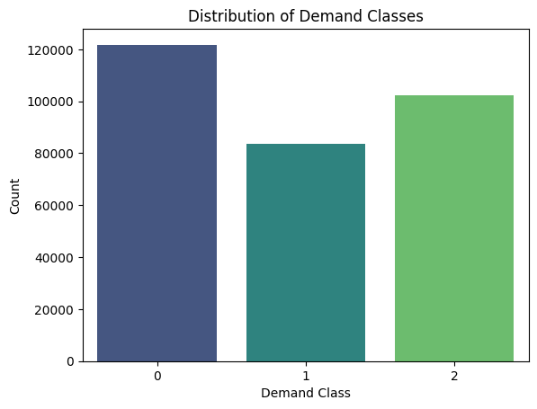
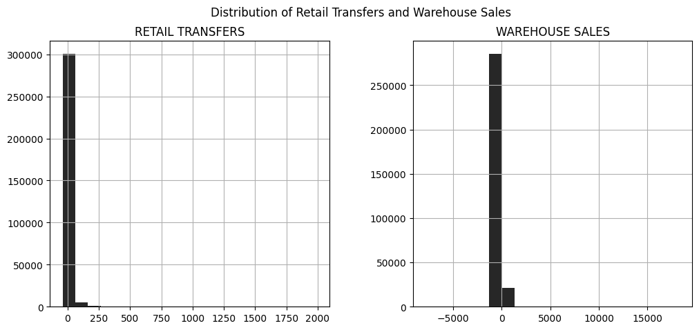
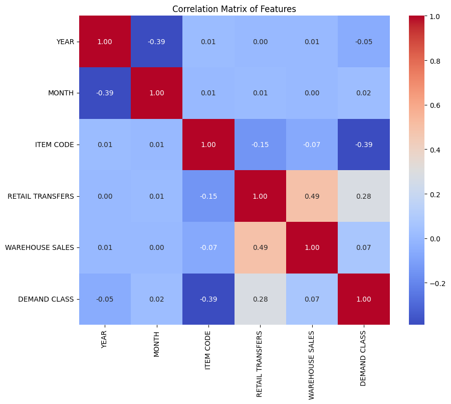
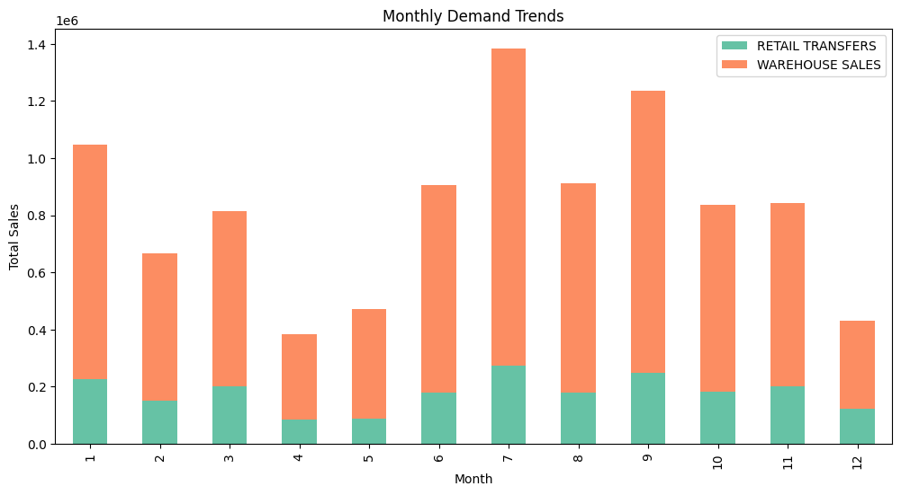
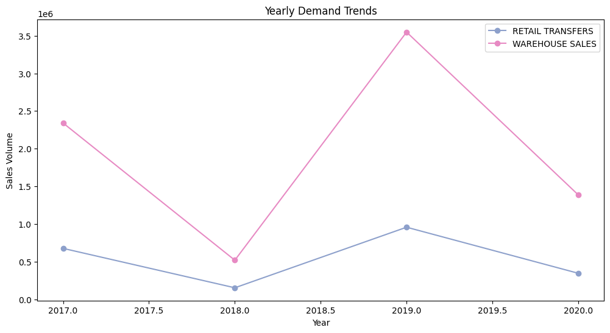
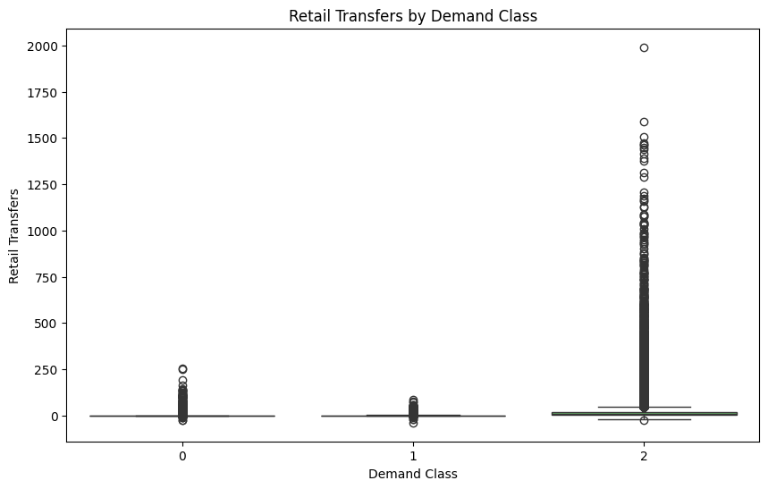
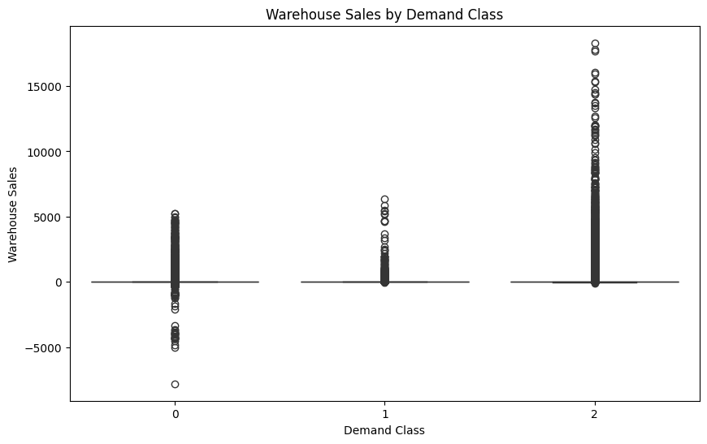
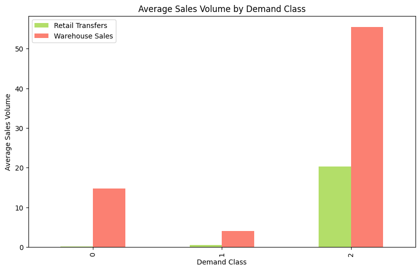
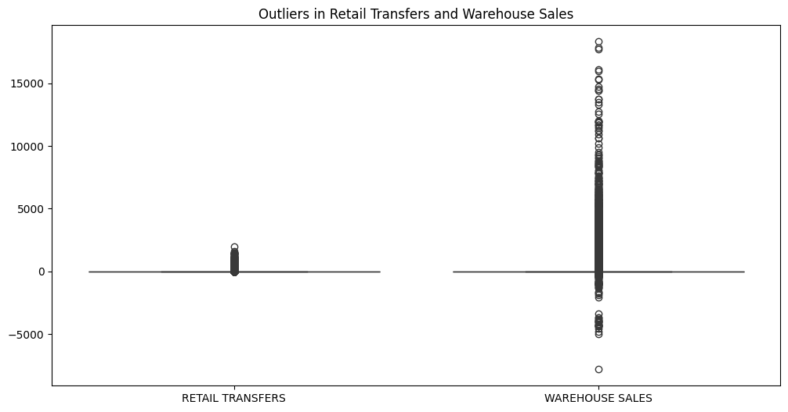

# Classification Model for Demand Class of Warehouse and Retail Sales
#### Original Dataset Source URL - https://catalog.data.gov/dataset/warehouse-and-retail-sales
#### Raw Dataset Source URL - https://data.montgomerycountymd.gov/api/views/v76h-r7br/rows.csv?accessType=DOWNLOAD

## Dataset Description
This dataset contains transactional data related to warehouse and retail sales, with features such as Year, Month, Item Code, Retail Transfers, and Warehouse Sales, however, contains irrelevant data such as supplier, item description, and item type. The data is used to classify demand levels (e.g., Low, Medium, High) based on specific sales attributes, enabling better inventory planning and demand forecasting.

## Summary of Findings
Exploratory Data Analysis (EDA) revealed distinct patterns in warehouse and retail sales, with significant monthly and yearly trends. High demand items typically exhibit more consistent sales patterns, while low and medium demand items display variability. These insights guided feature selection and model development to improve classification accuracy for demand levels.

## Data Preprocessing
The dataset was preprocessed to enhance data quality and model performance:

1. **Deletion**: Addressed redundant / irrelevant data by deleting them, since they would not provide any significance to the machine learning models.

2. **Handling Missing Values**: Addressed missing or incomplete data by padding with zero (0) value.

3. **Encoding**: Created numeric encodings for demand classes (Low, Medium, High) to enable classification model training.

## Exploratory Data Analysis (EDA)

- The exploratory data analysis (EDA) phase was essential for uncovering patterns and characteristics within the dataset. I began by utilizing the `df.info()` method, which provided insights into the structure, number of entries, and memory usage of the dataset. 

- Descriptive statistics were generated using `df.describe()`, revealing critical insights into the distribution of numeric features such as Retail Transfers and Warehouse Sales, highlighting their central tendency and dispersion. 

- I examined the first five entries of the dataset with `df.head()`, allowing for a tangible visualization of the data and confirming that preprocessing steps were correctly applied while enabling an initial assessment of potential relationships among variables. 

- To ensure data quality, I conducted a thorough check for missing values using the `isnull().sum()` method, identifying any columns containing missing data and enhancing the overall integrity of the dataset for subsequent modeling efforts. 

- This EDA phase not only informed feature selection and engineering strategies but also laid the groundwork for the modeling process by ensuring a comprehensive understanding of the dataset's characteristics.

## Visualization
Key visualizations helped illustrate sales trends and demand characteristics:
1. **Distribution of Demand Classes**:

 The chart reveals a significant imbalance in the distribution of demand classes, with class 0 (Low) dominating the dataset, followed by class (High), and class (Medium) being the least frequent.

2. **Distribution of Retail Transfers and Warehouse Sales**:

 The chart displays the distribution of retail transfers and warehouse sales, revealing a significant positive skew in both categories. This suggests that a majority of transactions involve smaller amounts, with a few larger transactions skewing the distribution to the right.

3. **Correlation Matrix of Features**:

 The correlation matrix highlights a strong positive association between Warehouse Sales and Retail Transfers, suggesting a direct relationship between the two. While Year and Month show a moderate negative correlation due to cyclical nature, other features exhibit weak to negligible correlations, indicating limited linear relationships.

4. **Monthly Demand Trend**:

 The bar chart illustrates the monthly demand trends for retail transfers and warehouse sales. Both categories exhibit seasonal patterns with peaks in months 7 and 9. While retail transfers remain relatively consistent throughout the year, warehouse sales show a more pronounced seasonal variation, with higher sales in the latter half of the year.

5. **Yearly Demand Trend**:

 The line chart depicts the yearly demand trends for retail transfers and warehouse sales. Both categories show a fluctuating pattern over the years. While retail transfers increased significantly in 2019, they declined in 2020. Warehouse sales exhibited a sharp increase in 2019 followed by a substantial decrease in 2020.

6. **Retail Transfers by Demand Class**:

 The box plot illustrates the distribution of retail transfers across different demand classes. Class 2 shows a higher median and a wider range compared to the other two classes. Classes 0 and 1 exhibit similar distributions with low medians and relatively narrow ranges. The presence of outliers in all classes suggests the existence of extreme values that deviate from the typical patterns.

7. **Warehouse Sales by Demand Class**:

 The box plot illustrates the distribution of warehouse sales across different demand classes. Class 2 shows a higher median and a wider range compared to the other two classes. Classes 0 and 1 exhibit similar distributions with low medians and relatively narrow ranges. The presence of outliers in all classes suggests the existence of extreme values that deviate from the typical patterns.

8. **Average Sales Volume by Demand Class**:

 The bar chart compares the average sales volume for retail transfers and warehouse sales across different demand classes. Both categories show an increasing trend with higher demand classes. Warehouse sales consistently exceed retail transfers in each class, indicating a greater volume of warehouse sales compared to retail transfers. Additionally, the difference in average sales volume between the two categories becomes more pronounced with increasing demand class.

9. **Outliers in Retail Transfers and Warehouse Sales**:

 The box plot illustrates the distribution of retail transfers and warehouse sales, highlighting the presence of numerous outliers in both categories. Retail transfers exhibit a smaller range with a few extreme values, while warehouse sales show a wider range with multiple outliers, suggesting greater variability in warehouse sales.

## Model Development
The following classification models were developed and tuned:
1. **CatBoost (CB) Classifier**: Efficient for high-dimensional data and demonstrated strong performance with limited preprocessing.
2. **AdaBoost (AB) Classifier**: Balanced performance but required tuning for class imbalance.
3. **Gradient Boosting Machine (GBM) Classifier**: Showed consistent accuracy and robustness across all demand classes.
4. **K-Nearest Neighbor (K-NN) Classifier**: Struggled with imbalanced data but achieved moderate accuracy after tuning.
5. **Light Gradient Boosting Machine (LGBM) Classifier**: Optimized for speed and demonstrated high accuracy with scaled features.
6. **Extreme Gradient Boost (XGB) Classifier**: Provided a strong baseline model with high accuracy across demand classes.

Each model was fine-tuned for hyperparameters to enhance classification accuracy and reduce prediction error.

## Model Evaluation

### K-Nearest Neighbors (K-NN)
- **Accuracy:** 84%
- **Execution Time:** 3.6 seconds  
- **Description:** K-NN achieved an accuracy of 84%, making it a competitive choice for classification. Its relatively fast execution time of 3.6 seconds suggests it can efficiently handle smaller datasets.

### Gradient Boosting Machine (GBM)
- **Accuracy:** 86%
- **Execution Time:** 1 minute 12.3 seconds  
- **Description:** GBM demonstrated the highest accuracy of 86%. However, it has a longer execution time compared to other models, indicating that it may require more computational resources.

### XGBoost (XGB)
- **Accuracy:** 86%
- **Execution Time:** 4.3 seconds  
- **Description:** XGBoost also achieved an accuracy of 86%, similar to GBM, but with significantly reduced execution time of just 4.3 seconds, making it a highly efficient choice.

### LightGBM (LGBM)
- **Accuracy:** 86%
- **Execution Time:** 3.2 seconds  
- **Description:** LightGBM matched the accuracy of 86% and provided the fastest execution time among the models at 3.2 seconds, indicating its capability for high performance on large datasets.

### CatBoost (CB)
- **Accuracy:** 86%
- **Execution Time:** 7.1 seconds  
- **Description:** CatBoost also achieved an accuracy of 86% with a moderate execution time of 7.1 seconds. Its performance reflects its robustness, especially with categorical features.

### AdaBoost (AB)
- **Accuracy:** 85%
- **Execution Time:** 17.7 seconds  
- **Description:** AdaBoost attained an accuracy of 85%, slightly lower than the others, with a longer execution time of 17.7 seconds, indicating it may be less efficient compared to other models.

## Conclusion
In conclusion, this project successfully developed a classification model aimed at predicting demand classes for warehouse and retail sales, leveraging a comprehensive dataset to derive valuable insights into sales patterns and trends. The Exploratory Data Analysis (EDA) revealed that higher demand items tend to exhibit consistent sales patterns, while lower demand items demonstrate significant variability, highlighting the importance of these insights for effective inventory management and demand forecasting. Among the various machine learning models evaluated, the Gradient Boosting Machine (GBM), XGBoost (XGB), LightGBM (LGBM), and CatBoost (CB) classifiers emerged as the top performers, achieving an impressive accuracy of 86%. Notably, LightGBM stood out with the fastest execution time of 3.2 seconds, making it particularly suitable for real-time applications that require quick predictions. However, GBM, while highly accurate, exhibited a longer execution time of 1 minute 12.3 seconds, suggesting it may be less ideal for scenarios demanding efficiency. The trade-offs between model accuracy and execution time were evident throughout the evaluation process, with K-Nearest Neighbors (K-NN) providing a respectable accuracy of 84% in a swift 3.6 seconds, but struggling with imbalanced data, while AdaBoost, despite a slightly lower accuracy of 85%, required longer processing time, indicating its potential inefficiency. Additionally, the analysis underscored the significance of feature importance, revealed through correlation analysis and visualizations, providing stakeholders with actionable insights for inventory decision-making. Moving forward, the project acknowledges opportunities for improvement, such as employing advanced techniques for managing imbalanced datasets, including synthetic data generation, and enhancing feature engineering strategies to uncover deeper insights into demand patterns. Overall, the project not only demonstrates the effective application of machine learning in demand classification but also sets a foundation for ongoing refinement and exploration to enhance predictive capabilities and applicability in real-world scenarios.

## Contributors
- John Hendrix Patricio